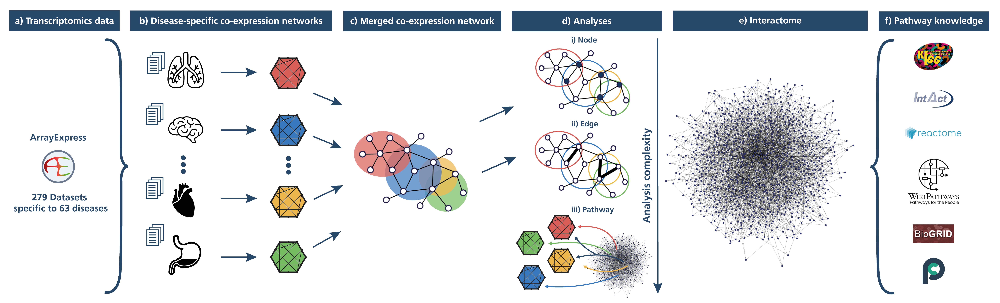

<h1 align="center">
  CoxPath
</h1>

## Table of Contents

* [General Info](#general-info)
* [Citation](#citation)
* [Generating co-expression networks from ArrayExpress](#generating-co-expression-networks-from-arrayexpress)
* [Datasets](#datasets)
* [Analyses](#analyses)
* [Results](#results)


## General Info
This repository contains code and data for described in detail in our paper, "Towards a global investigation of transcriptomic signatures through co-expression networks and pathway knowledge for the identification of disease mechanisms" (Figueiredo *et al.*, 2021), which systematically investigates the patterns observed in hundreds of transcriptomics datasets from over sixty indications by using pathways and molecular interactions as a template (see workflow below).

<p align="center">
  
</p>

## Citation

If you have found our study useful in your work, please consider citing:

Figueiredo, R. Q., Raschka, T., Kodamullill, A. T., Hofmann-Apitius, M., Mubeen, S., and Domingo-Fernández, D. (2021). [Towards a global investigation of transcriptomic signatures through co-expression networks and pathway knowledge for the identification of disease mechanisms](http://doi.org/10.1093/nar/gkab556), *Nucleic acid research*, *49*(14), 7939–7953. http://doi.org/10.1093/nar/gkab556

### Setup environment
Install requirements
 ```shell script
pip install -r requirements.txt
```

## Generating co-expression networks from ArrayExpress
Using the scripts outlined in [/R](/R), we queried datasets from ArrayExpress (AE) belonging to the most widely used platform, the Affymetrix Human Genome U133 Plus 2.0 Array (accession on AE: A-AFFY-44) and filtered for disease and healthy patient data. After manual curation to identify and merge disease ids, the WGCNA package in R constructed co-expression networks and the corresponding edge lists were saved for further analysis with python.
The resulting edge lists can be seen in the above Zenodo page.

## Datasets
Datasets can be directly downloaded from  [](https://doi.org/10.5281/zenodo.4700652)

To run the Python scripts and Jupyter notebooks the zip file from Zenodo has to be placed under /data.
The contents is as follows:
```
data
├── build_coexp_network
│   ├── OverviewDatasets.xlsx
│   └── < disease id or 'normal' > ×64
│       ├── datasets.txt
│       └── normal_metadata.tsv
├── DEgenes
│   └── < disease id > ×46
│       └── DEgenes.tsv
├── final_coexprNets
│   └── < disease id or 'normal' > ×64
│       └── coexp_network_edges.tsv
├── interactome
│   └── interactome_18_01_2021.tsv
├── misc_data
│   ├── 100000most_common_edges.json
│   ├── accession_gpl570ArrayExpress.csv
│   ├── datasetsToDelete.txt
│   ├── diseaseCuration_FINAL.tsv
│   ├── doid_group_clusters_dict.json
│   ├── errorDatasets.csv
│   └── metadata_FINAL.tsv
└── pathway
    ├── gene_pathway_assignment.json
    ├── kegg_hgnc_ids.gmt
    ├── kegg_mapping.json
    ├── long_term_potentiation.tsv
    ├── mpath.txt
    └── pathway_genes_dict.json
```

To generate this data, the following scripts have to be run in order:
1. /R/1_wrapMetadata_fromAE.R
2. /R/2_wrapMetadata_fromAE_cleanUp.R
3. /R/3-1_checkCuration.R
4. /R/3-2_concatCleanUpCuration.R
5. /R/3-3_diseaseCleanUp.R
6. /R/4_downloadData.R
7. /R/5_prepDataForWGCNA.R
8. /R/6_getNetworkFromExpData.R
9. /analysis/create_interactome.ipynb

## Analyses
Main portions of the analyses can be seen in the jupyter notebooks in [/analysis](/analysis) and can be reproduced by running the notebooks in the following order:
- /analysis/3.1_analysis.ipynb
- /analysis/3.2.1_analysis.ipynb
- /R/7_DEgenes.R
- /analysis/3.2.2_analysis.ipynb
- /analysis/3.3_analysis.ipynb
- /analysis/3.4_analysis.ipynb
- /analysis/3.5_analysis.ipynb

### Overview of disease-specific co-expression networks
- How many unique proteins (nodes) in each disease network?
- How many diseases in each disease cluster?
- How do the diseases relate to each other according to the Human Disease Ontology (DOID) hierarchy?
- Is there a dependency of network size(in terms of number of nodes) based on the amount of samples/datasets used?

### Investigating global trends of disease-specific co-expression networks at the node level
- What are the most and least common disease proteins across disease co-expression networks?
- Are there proteins present in all / only one disease co-expression network?
- Can the most / least common proteins be found in pathway knowledge?
- Differential gene expression analysis - identify genes which are consistently significantly differentially expressed between patient and control samples across diseases

### Investigating global trends of disease-specific co-expression networks at the edge level
- What are the most common edges across disease co-expression networks?
- What proportion of the most common edges across disease co-expression networks can be found in the normal network or interactome network?
- Of the overlap between most common edges across disease co-expression networks and the normal network, what proportion can be found in the interactome network?
- Of those that were not in the overlap between most common edges across disease co-expression networks and the normal network, what proportion can be found in the interactome network?
- In all these overlaps, are the proteins seen in those edges consistent?

### Overlaying co-expression networks with pathway knowledge supports the identification of disease associated pathways
- Can overlaying pathway knowledge with disease co-expression networks show patterns of certain pathways across certain diseases?
- Are there disease associated pathways?

### Case scenario: in-depth investigation of the long term potentiation pathway in the context of schizophrenia
- Select a pathway in previous section that was most associated with one disease and go in depth.
- Are the pathway edges in the co-expression network for that disease?
- What novel edges from the co-expression network can be proposed for the pathway?
- Are there patterns in the fold changes of the proteins from the pathway in that disease?

## Results
Results can be reproduced by running the jupyter notebooks outlined in the section above and summary results as figures and tables can be found in [/results/figures](/results/figures)

### Overview of disease-specific co-expression networks
[Figure 4](/results/figures/figure4-centered.png) gives an overview on the number of nodes of each of the co-expression networks clustered by major disease groups (A)) and a merged co-expression network clustering proteins by their association to different disease groups (B))
A): Here we see how many diseases are in each disease cluster as well as how big the individual networks are. Network size varies greatly, from 5,450 to 20,163 nodes. Disease clusters vary in size from 1 to 15 diseases.
B): Here we see how many nodes are associated to a disease cluster. Association was determined by selecting the set of nodes which are present in all of the diseases of a given disease cluster, and eliminating those nodes which were also present in all diseases of other clusters. This resulted in unique sets of nodes which are guaranteed to be found in all diseases of the given cluster, but not in all of another cluster. As expected, we observe an inverse correlation between the number of diseases in a cluster and the size of the associated node subset.

[Supplementary figure 1](/results/figures/supp_figure1.png) gives an overview of all the diseases and how they relate to each other according to the Human Disease Ontology (DOID) hierarchy.
Here we see the the hierarchy as a tree, starting with the DOID root "disease". All nodes are labeled with their DOID. All branches are excluded past the last node which correspond to one of our diseases. Roots for clusters are labeled and diseases within them are color-coded. Additionally, diseases for which we have a co-expression network are labeled with their disease name and a tuple giving (number of samples, number of datasets used).

[Supplementary figure 2](/results/figures/supp_figure2.png) plots the correlation between number of nodes to number of datasets (left) and number of samples (right) for all diseases.
Here we see that neither the number of datasets nor the number of samples used to construct the co-expression networks show any correlation te resulting network size

[Supplementary table 1](/results/tables/supp_table1.tsv) summarizes the diseases used in this analysis. Table shows each disease name, DOID, number of datasets used,	number of samples used, 	number of nodes in co-expresssion network,	number of edges in co-expression network, and	assigned cluster group.

### Investigating global trends of disease-specific co-expression networks at the node level
[Supplementary figure 3](/results/figures/supp_figure3.png) shows the distribution of the frequency of all proteins across the disease co-expression networks.
Here we see that the majority of the proteins are present in ~35-40 of the 63 diseases.

Supplementary figures [4,](/results/figures/supp_figure4.png) [5,](/results/figures/supp_figure5.png) and [12](/results/figures/supp_figure12.png) illustrates the similarity of the proteins in the disease co-expression network and of the Human interactome network.
Sup. fig. 4: Here we see the overlap between all proteins of the interactome and all proteins of the disease co-expression networks. 88% of the interactome proteins and 37.5% of the disease proteins overlap.
Sup. fig. 5: Here we see the overlap between proportional amounts of the most well-connected proteins of the interactome and most common proteins of disease co-expression networks. The overlap is very minimal: 0-3%
Sup. fig. 12: Here we see the overlap between proportional amounts of the least well-connected proteins of the interactome and least common proteins of disease co-expression networks. The overlap is less minimal: 3-10%

Supplementary figures [6,](/results/figures/supp_figure6.png) [8,](/results/figures/supp_figure8.png) and [13](/results/figures/supp_figure13.png) illustrates the similarity of the proteins in the disease co-expression network and of the STRING PPI network.
Sup. fig. 6: Here we see the overlap between all proteins of the STRING PPI network and all proteins of the disease co-expression networks. 85% of the STRING proteins and 80% of the disease proteins overlap.
Sup. fig. 8: Here we see the overlap between proportional amounts of the most well-connected proteins of the STRING PPI network and most common proteins of disease co-expression networks. The overlap is very minimal: 0-2.25%
Sup. fig. 13: Here we see the overlap between proportional amounts of the least well-connected proteins of the STRING PPI network and least common proteins of disease co-expression networks. The overlap is minimal: 1-2.5%

Supplementary figures [7,](/results/figures/supp_figure7.png) [9,](/results/figures/supp_figure9.png) and [14](/results/figures/supp_figure14.png) illustrates the similarity of the proteins in the disease co-expression network and of the HIPPIE PPI network.
Sup. fig. 7: Here we see the overlap between all proteins of the HIPPIE PPI network and all proteins of the disease co-expression networks. 89% of the HIPPIE proteins and 79% of the disease proteins overlap.
Sup. fig. 9: Here we see the overlap between proportional amounts of the most well-connected proteins of the HIPPIE PPI network and most common proteins of disease co-expression networks. The overlap is very minimal: 0-1.5%
Sup. fig. 14: Here we see the overlap between proportional amounts of the least well-connected proteins of the HIPPIE PPI network and least common proteins of disease co-expression networks. The overlap is less minimal: 1-2.75%

Supplementary figures [10,](/results/figures/supp_figure10.png) [11,](/results/figures/supp_figure11.png) and [15](/results/figures/supp_figure15.png) illustrates the similarity of the proteins in the disease co-expression network and of KEGG pathways.
Sup. fig. 10: Here we see the overlap between all proteins in KEGG pathways and all proteins of the disease co-expression networks. 86.5% of the KEGG proteins and 34% of the disease proteins overlap.
Sup. fig. 11: Here we see the overlap between proportional amounts of the most common KEGG proteins and most common proteins of disease co-expression networks. The overlap is very minimal: 0-5%
Sup. fig. 15: Here we see the overlap between proportional amounts of the least common KEGG proteins and least common proteins of disease co-expression networks. The overlap is less minimal: 2-13.5%

[Supplementary table 2](/results/tables/supp_table2.tsv) lists statistics on the average degrees of the nodes in the co-expression and PPI networks used as well as the average degree of select nodes which overlap with most common proteins of disease co-expression networks and the the most well-connected proteins.

[Supplementary table 4](/results/tables/supp_table4.tsv) lists the proteins in the overlap in the previously mentioned comparisons.

[Figure 5](/results/figures/figure5.png) plots the consensus for consistently differentially expressed genes.
Here we see a volcano plot highlighting the most significantly up- and down- regulated genes according to two set cutoffs (i.e., adjusted *p*-value < 0.01 and |log<sub>2</sub> *fold change*| > 1.75)

[Supplementary table 5](/results/tables/supp_table5.tsv) lists the most significantly up- and down- regulated genes from the figure above

### Investigating global trends of disease-specific co-expression networks at the edge level
This section investigates the unique and most common edges patterns and compares them against the normal co-expression network and the interactome.

### Overlaying co-expression networks with pathway knowledge supports the identification of disease associated pathways
[Figure 6](/results/figures/figure6.png) shows the mapping of disease-specific expression patterns with pathway knowledge via network similarity.
Here we see patterns of groups of pathways being especially expressed in certain disease clusters.

[Supplementary figure 16](/results/figures/supp_figure16.png) shows an alternate mapping of disease-specific expression patterns with pathway knowledge via network similarity via the interactome.
Here we see similar patterns of groups of pathways being especially expressed in certain disease clusters.

[Supplementary table 6](/results/tables/supp_table6.tsv) lists the pathways that were found to be especially expressed in cognitive disorders.

[Supplementary table 7](/results/tables/supp_table7.tsv) lists the pathways that were found to be especially expressed in gastrointestinal system diseases.

[Supplementary table 8](/results/tables/supp_table8.tsv) lists the pathways that were found to be especially expressed in reproductive system diseases.

[Supplementary table 9](/results/tables/supp_table9.tsv) lists the shared pathways that were found to be especially expressed in a number of cancers.

[Supplementary table 10](/results/tables/supp_table10.tsv) lists the pathways that were found to be especially expressed in the disease dermatomyositis.

### Case scenario: in-depth investigation of the long term potentiation pathway in the context of schizophrenia
The case scenario can be reproduced with other diseases and pathways, follow the instructions in the [jupyter noteobook](/analysis/3.5_analysis.ipynb)

[Figure 7](/results/figures/figure7.png) visualizes the long term potentiation (LTP) pathway in the context of schizophrenia.
Here we combine the known pathway protein relations and overlay data from the disease which was found to show the highest pathway similarity. Fold changes of the proteins in schizophrenia that involved in the pathway are highlighted. Proteins that have been found to have high co-expression values from the disease co-expression network are highlighted if there is additionally relations between them in the pathway, and proposed as new edges if not.

[Supplementary table 11](/results/tables/supp_table11.tsv) lists four pathways involving a key regulator of the LTP pathway in efforts to pinpoint candidate downstream pathways of LTP, indicating that there may be crosstalk between these pathways that could be explored in the future.


